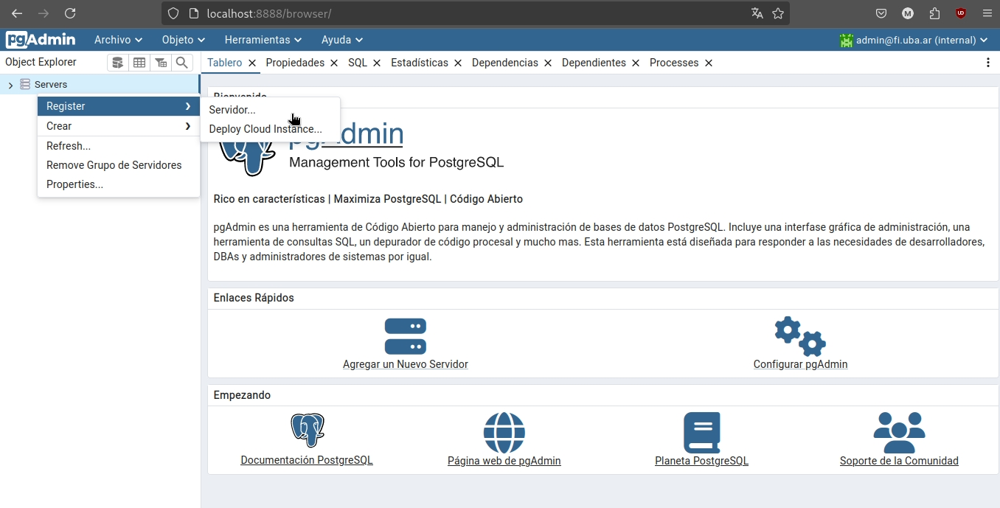
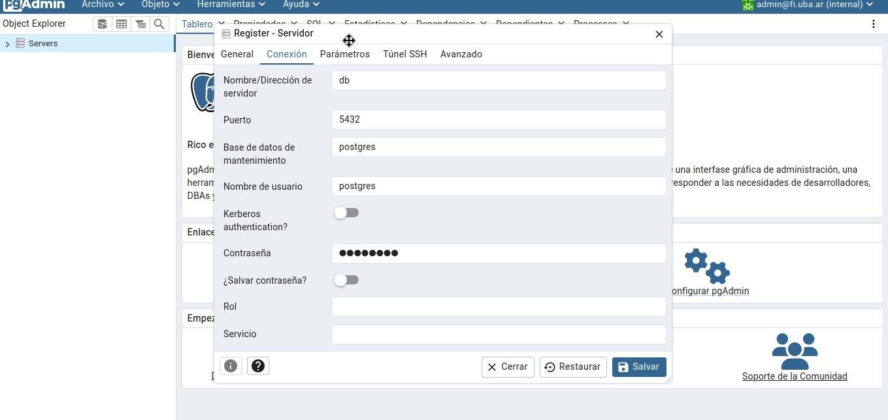

# TP - INTEGRADOR - (SteamOpinions) (Miguel Zorrilla 110619)

TP final de la materia de INTRODUCCIÓN AL DESARROLLO DE SOFTWARE de la carrera de Ingeniería Informática de la Facultad de Ingeniería de la UBA.

---

### Instalación:

Para ejecutar todos los programas es necesario utilizar **docker** por lo tanto instala en tu distribución de linux los siguientes paquetes:
`docker` y `docker-compose`.

Una vez instalado es necesario activar el servicio de docker:

```bash 
sudo systemctl start docker.service 
```

Si quieres que el servicio esté activo cada vez que enciendas las computadora puedes usar:

```bash 
sudo systemctl enable docker.service
```


Una vez hecho esto clonas el repositorio.

```bash 
git clone <Este repositorio>
cd INTRO-TP/
```

ejecuta el siguiente comando, este construirá las imagenes locales. 

```bash
make instalar
```

--- 

# Entorno de trabajo: 

Cuando este todo instalado ya puedes iniciar los contenedores con:


```bash
 make iniciar
```

Puertos: 

- PgAdmin(Administrar la Base de datos): **Tarda como 1 minuto en arrancar**.  Este se ubica en el puerto **:8888** [Click aquí para acceder al PgAdmin](http://localhost:8888/)
- Postgresql: Se ubica en el puerto **:5432**

- API: Esta ubicado en el puerto **:5000** [Click aquí](http://localhost:5000/)

- Servidor Web: Esta ubicado en el puerto **:8000** [Click aquí](http://localhost:8000/)


Para cerrar todos los contenedores usa:

```bash
    make apagar
```

--- 

### PgAdmin:

El usuario del pgadmin es: `admin@fi.uba.ar` y la contraseña es `admin123`

- **¿Cómo conectar la base?**:

Click derecho > register > servidor 

<div align="center">

</div>


Te diriges a conexión y pones lo siguientes datos:
```
Nombre/Direccion del servidor = db 
Puerto = 5432
Nombre de usuario = postgres
Contraseña = postgres
```

<div align="center">

</div>


